# 🎯 JobHunter AI: Автономный AI-агент поиска работы (HH.ru + Telegram + DeepSeek R1 + Google Sheets)

Автоматизированная multi-agent система карьерного поиска на платформе **n8n**, оснащенная локальной reasoning-нейросетью **DeepSeek R1 (14B)** для непрерывного мониторинга, глубокой фильтрации и структурированного отбора вакансий коммерческого руководства и B2B-продаж.

---

## 🚀 Архитектура системы

Система состоит из двух независимых конвейеров, работающих параллельно в единую Google Таблицу с разделением на две вкладки:
* **`JobHunt_РОП`** — только целевые вакансии (`READY`), готовые к отклику.
* **`JobHunt_Rejected`** — техническая вкладка отклонённых вакансий (`REJECTED`) для сквозной дедупликации.

```mermaid
flowchart TD
    subgraph "Конвейер 1: HeadHunter (каждые 2 часа)"
        HH_T["Schedule Trigger (2h)"] --> HH_S["9 поисковых срезов HH API\n(РОП, BDM, KAM, FinTech, SaaS, B2B...)"]
        HH_S --> HH_D["Сквозная дедупликация\n(сверка по двум вкладкам Google Sheets)"]
        HH_D --> HH_L["Loop Over Items (по 1 шт)"]
        HH_L --> HH_Det["HTTP - HH Details\n(загрузка полной карточки)"]
        HH_Det --> HH_AI["Ollama DeepSeek R1 (14B)\n(анализ требований + сводка 🏢|💰|🎯)"]
        HH_AI --> HH_IF{"is_relevant?"}
        HH_IF -->|Да| HH_R["Google Sheets: JobHunt_РОП (READY)"]
        HH_IF -->|Нет| HH_Rej["Google Sheets: JobHunt_Rejected (REJECTED)"]
    end

    subgraph "Конвейер 2: Telegram Channels (каждые 3 часа)"
        TG_T["Schedule Trigger (3h)"] --> TG_F["10 каналов через RSSHub\n(Finder.vc, Удаленка 2.0, Joker Sales...)"]
        TG_F --> TG_Pre["JS Pre-Filter стоп-слов\n(отсев офиса, разработчиков, инфобиза)"]
        TG_Pre --> TG_Mem["Двойная память дедупликации\n(Google Sheets + StaticData)"]
        TG_Mem --> TG_L["Loop Over Items (по 1 шт)"]
        TG_L --> TG_AI["Ollama DeepSeek R1 (14B)\n(извлечение роли + контактов @user/email)"]
        TG_AI --> TG_IF{"is_relevant?"}
        TG_IF -->|Да| TG_R["Google Sheets: JobHunt_РОП (READY)"]
        TG_IF -->|Нет| TG_Drop["Сохранение в память StaticData\n(не спамит в таблицу)"]
    end
```



---

## 🌟 Ключевые возможности

1. **Многопрофильный мониторинг официального рынка (HeadHunter):**
   * 9 отдельных поисковых срезов с параметрами: `schedule=remote`, `period=7`, `per_page=100`.
   * Защита от банов HH API: задержки `Wait 1s` между запросами и порционная обработка по 1 вакансии.
2. **Парсинг закрытого рынка (Telegram):**
   * Мониторинг 10 ведущих каналов удалённой работы через шлюз RSSHub.
   * Автоматическое извлечение прямых контактов нанимателя (`@username` или `email`).
3. **Строгая предфильтрация без лишних затрат GPU:**
   * Быстрый регулярный JavaScript-фильтр отсекает 80% мусора (программисты, дизайнеры, офис) до отправки в модель.
   * Двухуровневое хранилище истории предотвращает повторный анализ постов.
4. **Локальная нейросеть DeepSeek R1 (14B):**
   * Анализ длинных описаний без затрат на платные облачные API.
   * Жесткие критерии: **100% удаленка**, **график 5/2**, **оклад от 100 000 ₽ / доход от 150 000 ₽**, табу на инфобизнес, крипту, холодные звонки без оклада.
   * Вместо шаблонных писем генерирует краткую сводку:
     `🏢 Бизнес: [...] | 💰 Доход: [...] | 🎯 Задачи: [...]`
5. **Чистота и разгрузка базы данных:**
   * Разделение потоков: одобренные вакансии остаются в главной вкладке, отказы с указанием причины уходят во вторую техническую вкладку.

---

## 📁 Структура репозитория

```
jobhunter-ai/
├── README.md                           # Основное описание проекта
├── .gitignore                          # Защита от коммита секретов и токенов
├── workflows/                          # Готовые к импорту сценарии n8n
│   ├── hh_jobhunter_workflow.json      # Воркфлоу HeadHunter (31 нода)
│   └── tg_jobhunter_workflow.json      # Воркфлоу Telegram (28 нод)
├── prompts/                            # Системные промпты и правила фильтрации
│   ├── hh_system_prompt.txt            # Системный промпт для HeadHunter
│   └── tg_system_prompt.txt            # Системный промпт для Telegram
├── docs/                               # Руководства по настройке
│   ├── google_sheets_setup.md          # Пошаговая настройка Google Sheets
│   └── ollama_setup.md                 # Установка и запуск модели DeepSeek в Ollama
└── scripts/
    └── test_ollama_filter.py           # Скрипт тестирования промпта без n8n
```

---

## 🛠️ Быстрый старт

### 1. Подготовка окружения
1. Установите [n8n](https://docs.n8n.io/hosting/) (локально через npm или Docker).
2. Установите [Ollama](https://ollama.com/) и загрузите модель:
   ```bash
   ollama run deepseek-r1:14b
   ```
3. Настройте Google Таблицу по инструкции [docs/google_sheets_setup.md](docs/google_sheets_setup.md).

### 2. Импорт сценариев в n8n
1. Откройте n8n ➔ **Workflows** ➔ **Import from File**.
2. Выберите файлы из папки `workflows/`:
   * `hh_jobhunter_workflow.json`
   * `tg_jobhunter_workflow.json`
3. В параметрах нод укажите свои данные:
   * **Google Sheets:** укажите URL вашей таблицы и выберите Service Account.
   * **HeadHunter:** в заголовках HTTP-запросов укажите свой `User-Agent` и `Authorization: Bearer <YOUR_HH_TOKEN>`.
4. Активируйте переключатель **Active** на обоих сценариях.

---

## ⚙️ Кастомизация критериев отбора

Чтобы адаптировать фильтрацию под свой профиль, отредактируйте ноду `Prepare Ollama Body` в n8n (или файлы в папке `prompts/`):
* **Желаемые роли:** РОП, BDM, KAM, Commercial Director, Enterprise Sales.
* **Финансовая планка:** измените порог фиксированного оклада (по умолчанию от 100 000 ₽) и совокупного дохода (от 150 000 ₽).
* **Формат:** 100% полная удалёнка / гибрид.

---

## 🔒 Безопасность

* Все реальные токены авторизации HH API и ссылки на закрытые Google-документы в файлах репозитория заменены на плейсхолдеры (`YOUR_HH_API_BEARER_TOKEN`, `YOUR_SPREADSHEET_ID`).
* Файл `.gitignore` исключает случайную публикацию ключей сервисных аккаунтов (`service_account.json`), логов и локальных баз данных n8n.

---

## 📄 Лицензия

MIT License. Свободно для использования и модификации под личные карьерные задачи.
